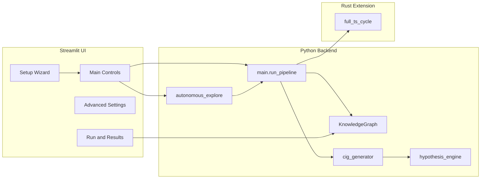

# CIG-APP-V1 Architecture

This document describes the architecture of CIG-APP-V1 and its relationship to the broader GOAT-TS (Thinking System) vision. It covers the application layer (SQLite + Rust + Streamlit), data flow, and configuration.

## 1. System Split: GOAT-TS Core vs CIG-APP-V1

### GOAT-TS Core (Reference / Future)

The full GOAT-TS vision uses:

- **Storage**: NebulaGraph for persistent graph; Redis for caching.
- **Compute**: Spark for ETL-based ingestion (text → triples, concept merging with PyTorch/FAISS).
- **TS loop**: Cognition loop (e.g. `demo_loop.py`) with propagation `A_i(t+1) = f(Σ_j A_j(t) W_ji) − λA_i(t)` over ticks, decay λ, state transitions, optional physics-based gravity for clustering.
- **Deployment**: Docker/Kubernetes scaffolding for scaling.

Node/edge semantics in that world include: nodes (label, mass, activation A_i(t), state ACTIVE/DORMANT/DEEP, cluster_id, metadata, implicit timestamp τ_i); edges "relates" (weights W) and "in_wave" for provenance; waves as episode nodes.

### CIG-APP-V1 (This Repository)

CIG-APP-V1 is the **application layer** that implements a **local-first**, lightweight CIG:

- **Storage**: SQLite-backed graph (`nodes` and `edges` tables) plus optional `vectors` / sqlite-vss for embeddings.
- **Compute**: Hybrid Python + Rust. Rust (maturin extension in `rust/`) does performance-critical TS propagation; Python orchestrates ingestion, CIG generation, and UI.
- **UI**: Streamlit (`app_ui.py`) with wizard-first setup, Main Controls, Advanced Settings, and Run & Results.
- **No GPU required**; runs on low-end hardware.

The **unified CIG** idea: both systems share the same conceptual graph (nodes = concepts, edges = relationships, activation propagation). CIG-APP-V1 uses a subset of the GOAT-TS schema and rules, tuned for single-machine, SQLite-backed operation.

---

## 2. Component Overview

- **app_ui.py**: Loads `config.yaml` and `.env`; provides tabs (Setup Wizard, Main Controls, Advanced Settings, Run & Results). Calls `run_pipeline` or `run_autonomous_explore` and displays results.
- **main.run_pipeline**: Opens or receives a `KnowledgeGraph`, ingests optional text, sets/creates seed node, runs Rust TS propagation (if available), then `cig_generator.generate_all` (idea map, context expansion, hypotheses). Returns a result dict (seed, node_id, cig, graph, config, rust_used, error).
- **autonomous_explore.run_autonomous_explore**: Multi-cycle loop over seeds; each cycle: generate queries (heuristic or Ollama), optional web search and ingest, then `run_pipeline(..., kg=kg)` per seed; optional reflection cycles and LLM reflection. Shares one KG across cycles.
- **knowledge_graph.KnowledgeGraph**: SQLite graph (nodes: id, label, mass, activation, state, metadata; edges: from_id, to_id, type, weight). Optional vectors table and sqlite-vss for 384-d embeddings. Methods: add_node, add_edge, ingest_text, to_rust_graph, from_rust_graph, to_json, get_node_by_label, etc.
- **cig_generator.generate_all**: Builds idea map (BFS subgraph), context expansion (connected components), and calls **hypothesis_engine.generate_hypotheses** (similarity/tension + optional Ollama phrasing).

---

## 3. Node and Edge Schemas (CIG-APP-V1)

Aligned with GOAT-TS semantics where applicable:

### Nodes

| Column      | Type    | Meaning |
|------------|---------|--------|
| id         | INTEGER | Primary key (auto). |
| label      | TEXT    | Concept label (e.g. "artificial intelligence"). |
| mass       | REAL    | Node mass (default 1.0). |
| activation | REAL    | Activation A_i(t); updated by TS propagation. |
| state      | TEXT    | ACTIVE / DORMANT / DEEP (or empty). |
| metadata   | TEXT    | Optional JSON or free text. |

Implicit timestamp τ_i is not stored in SQLite in the current implementation; it can be added for time-based decay in future (see TS_MODEL.md).

### Edges

| Column  | Type    | Meaning |
|---------|---------|--------|
| from_id | INTEGER | Source node id. |
| to_id   | INTEGER | Target node id. |
| type    | TEXT    | "relates" (default), "conflict", or custom. |
| weight  | REAL    | Edge weight W_ji used in propagation. |

Wave/episode nodes (e.g. "in_wave" edges for provenance) are not yet modeled in CIG-APP-V1; the Rust engine tracks a single propagation run from a seed.

### Optional: Vectors

When `vector.enabled` and sqlite-vss are available:

- **vectors**: (id, embedding BLOB) for node_id → 384-d float vector.
- **vss_embed**: sqlite-vss virtual table for similarity search.
- **vector_node_map**: Maps node_id to vss rowid.

### Hybrid graph–vector reasoning

- **embeddings.py**: Optional sentence-transformers (all-MiniLM-L6-v2, 384-d). `embed_safe` / `embed_batch_safe` are no-ops when unavailable.
- **vector_store.py**: Abstraction with backends `memory`, `sqlite_vss` (wraps KnowledgeGraph), and optional `faiss`. Used for consistent add/query of node vectors; TS loop can later use it for vector-augmented activation (§4).
- **hypothesis_engine**: Uses embeddings and/or sqlite-vss to find high-similarity node pairs without edges; optionally adds `suggested_relates` edges when `vector.add_suggested_edges` is true.

---

## 4. Configuration and Environment

### config.yaml

Unified keys used by the pipeline and autonomous layer:

| Section                | Keys | Purpose |
|------------------------|------|--------|
| graph                  | path | SQLite DB path (default `data/knowledge_graph.db`). |
| wave                   | ticks, decay, activation_threshold | TS propagation parameters. |
| similarity_threshold   | -    | Minimum similarity for hypothesis suggestions. |
| tension_threshold      | -    | Activation difference for tension edges. |
| llm                    | -    | Master LLM switch (true/false). |
| llm_ollama             | enabled, host, model, use_for_hypotheses, use_for_autonomous | Ollama integration. |
| online                 | enabled, max_requests_per_run, timeout_seconds | Web search (DuckDuckGo) in autonomous. |
| export                 | default_dir | Directory for CSV/JSON/GraphML exports. |
| advanced_autonomous    | reflection_cycles, multi_seed, curiosity_bias, llm_reflection | Autonomous loop options. |
| monitoring             | show_progress | UI progress display. |
| advanced               | embeddings.enabled | Optional embeddings. |
| vector                 | enabled | Optional sqlite-vss. |
| ingestion              | pdf_enabled | PDF ingestion. |

### .env Overrides

Loaded by `load_config()` (in app_ui) or at startup; they override or supply defaults for config:

| Variable | Effect |
|----------|--------|
| CIG_ONLINE_ENABLED | Sets `online.enabled` (0/1 or true/false). |
| CIG_SEARCH_API_KEY | Optional future search API key. |
| OLLAMA_HOST / CIG_OLLAMA_HOST | Sets `llm_ollama.host`. |
| OLLAMA_MODEL / CIG_OLLAMA_MODEL | Sets `llm_ollama.model`. |

See `.env.example` and `validate_config.py` for validation.

### Scalability and resource limits

- **resource_limits** in config: `max_nodes`, `max_ticks_per_run` are enforced in `run_pipeline`; autonomous already caps `online.max_requests_per_run`.
- **Frontier-based propagation** (`wave.use_frontier`) reduces work on large graphs by only pushing from nodes above threshold.
- **Sparse / sharding**: Full sparse structures (CSR) and cross-shard sync (e.g. Redis/Kafka) are GOAT-TS roadmap items; CIG-APP-V1 uses a single SQLite graph and optional frontier mode.

---

## 5. Data Flow Summary

1. **User** sets seed and mode (Dry / Full) in Main Controls; optionally enables autonomous (5 cycles).
2. **app_ui** loads config (with .env overrides), then calls either:
   - `run_pipeline(seed, config_path, config, ticks_override=10, progress_callback=...)` for a single run, or
   - `run_autonomous_explore(seed, config_path, config, max_cycles=5, seeds=[...], ...)` for multi-cycle.
3. **run_pipeline**: Opens KG (or uses passed-in kg), ingest_text if provided, ensures seed node exists with activation 1.0, exports graph to Rust via `to_rust_graph()`, runs `rg.full_ts_cycle(seed_rust_id, ticks, decay, threshold)`, imports activations back via `from_rust_graph()`, then runs `cig_generator.generate_all(kg, node_id, ...)`.
4. **generate_all**: Produces idea_map, context_expansion, and hypotheses (with optional Ollama phrasing). Result is returned to the UI.
5. **UI** stores the result in `st.session_state.last_run_result` and shows it in the Run & Results tab (idea map, hypotheses, cycles, graph PNG, CSV/JSON/GraphML exports).

---

## 6. File Layout (Relevant to Architecture)

- **app_ui.py**: Streamlit app (wizard, tabs, run triggers).
- **config.yaml**, **.env**: Configuration and overrides.
- **python/goat_ts_cig/main.py**: `run_pipeline`.
- **python/goat_ts_cig/autonomous_explore.py**: `run_autonomous_explore`, `generate_next_queries`.
- **python/goat_ts_cig/knowledge_graph.py**: `KnowledgeGraph` (SQLite + optional vss).
- **python/goat_ts_cig/cig_generator.py**: Idea map, context expansion, evidence chains.
- **python/goat_ts_cig/hypothesis_engine.py**: Similarity/tension hypotheses, Ollama phrasing.
- **rust/**: Maturin extension (e.g. `full_ts_cycle` for propagation).
- **validate_config.py**: Config and .env validation script.
