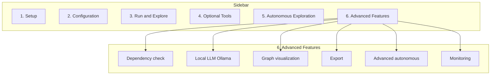

# ENHANCEMENTS.md: UI Enhancements and Next Development Phases (GOAT-TS / CIG-APP)

## Document Metadata

- **Version**: 1.0
- **Date**: March 2026
- **Purpose**: Addendum for an autonomous coding agent to implement UI enhancements and next development phases. Builds on existing PLAN.md (Steps 1–58) and the repo at https://github.com/BoggersTheFish/GOAT-PUBLIC_TEST.
- **Scope**: New Streamlit UI section "6. Advanced Features," local LLM (Ollama) integration, graph visualization, export options, advanced autonomous modes, and basic monitoring. All features have dedicated UI controls; optional dependencies are detected and either auto-installed (with user confirmation) or guided via expanders.
- **Constraints**: Low-end hardware; no GPU-only dependencies; minimal new requirements; integrate with existing config.yaml and .env.

---

## 1. Analysis of Integration with Existing UI and Repo

### 1.1 Current Repository State (March 2026)

- **Structure**: `data/`, `examples/`, `python/goat_ts_cig/`, `python/bindings/`, `rust/src/`, `tests/`. Root files: `app_ui.py`, `run.py`, `run_tests.py`, `config.yaml`, `requirements.txt`, `.env.example`.
- **UI**: `app_ui.py` uses `st.sidebar.radio("Step", ["1. Setup", "2. Configuration", "3. Run & Explore", "4. Optional Tools", "5. Autonomous Exploration"])`. Each step is an `if step == "..."` / `elif step == "..."` block. Patterns: `st.expander` for config sections, `st.button` for actions, `st.checkbox`/`st.slider`/`st.text_input` for inputs, `load_config()`/`save_config()` for persistence, `st.session_state` for run results.
- **Existing features**: Seed input, ingest (paste/upload), run pipeline (normal or autonomous), config edit (graph, wave, hypothesis, LLM stub, online). Autonomous mode uses DuckDuckGo search and heuristic query generation.
- **Config**: `config.yaml` has `graph`, `wave`, `similarity_threshold`, `tension_threshold`, `llm`, `online`. `.env.example` has `CIG_ONLINE_ENABLED`, `CIG_SEARCH_API_KEY`. `.env` is loaded in `load_config()` and overrides applied.
- **Reuse**: Subprocess for pip install in Setup; expanders for Configuration; session state for `last_run_result` and `last_autonomous_result`; CONFIG_PATH and ROOT.

### 1.2 Integration Strategy

- Add a **sixth sidebar step**: "6. Advanced Features." All new capabilities (LLM, graph viz, export, advanced autonomous, monitoring) are configured and triggered from this step or from sub-expanders within it. No removal of existing steps.
- **Dependency handling pattern** (for each optional feature):
  1. **Detect**: Try import or run a subprocess (e.g. `ollama list` or `python -c "import graphviz"`). Set a flag e.g. `ollama_available`, `graphviz_available`.
  2. **If missing**: Show `st.warning("Feature X requires ...")` and an expander "How to enable" with step-by-step instructions (e.g. "Install Ollama from https://ollama.ai and run `ollama pull llama2`"). Option A: add a button "Try install (pip install X)" that runs subprocess and re-runs; Option B: add "I've completed the steps" confirmation button that re-checks and enables the feature. Prefer **guided install** (expander + confirm) for external tools (Ollama); **optional pip install button** for pure Python deps (graphviz, matplotlib) with user confirmation.
  3. **If present**: Show the feature's controls (sliders, toggles, buttons) and allow use.
- **Config persistence**: New options live under new top-level keys in config.yaml (e.g. `llm_ollama`, `export`, `advanced_autonomous`, `monitoring`) and are read/written in Configuration step or in Advanced Features. Use the same `load_config()` / `save_config()` and optionally `.env` (e.g. `CIG_OLLAMA_HOST`).
- **Tests**: New modules get unit tests in `tests/`; new UI paths are covered by integration tests that call the underlying functions (e.g. export_graph_png) with mocked or minimal data.

---

## 2. Updated Architecture Proposal

### 2.1 New Components

| Component | Location | Purpose |
|-----------|----------|---------|
| **Advanced Features step** | `app_ui.py` | Sixth sidebar step; contains expanders for LLM, Graph viz, Export, Advanced autonomous, Monitoring. Each expander has dep check, guidance if missing, and controls if available. |
| **Ollama adapter** | `python/goat_ts_cig/llm_ollama.py` | Optional. `generate(prompt, host, model)` using `requests` to Ollama API. Used by hypothesis_engine and autonomous_explore when config enables it. |
| **Graph visualizer** | `python/goat_ts_cig/graph_viz.py` | `export_subgraph_png(kg, seed_id, path, engine="graphviz"|"matplotlib")`. Uses graphviz or matplotlib; returns path or bytes. |
| **Export module** | `python/goat_ts_cig/export_utils.py` | `export_graph_csv(kg, path)`, `export_cig_json(result, path)`. Write graph nodes/edges and CIG result to files. |
| **Advanced autonomous** | `python/goat_ts_cig/autonomous_explore.py` (extend) | Add `reflection_cycles`, `multi_seed` (list of seeds). New config keys and UI toggles. |
| **Progress hook** | `python/goat_ts_cig/main.py` or small `progress.py` | Optional callback during TS/propagation so UI can show progress (e.g. "Tick 3/10"). Streamlit: use `st.empty()` and update in a thread or via fragment. |

### 2.2 Architecture Diagram (Addendum)



Text structure:

- **LLM (Ollama)**: Detect via GET /api/tags; if missing: st.warning + expander "Install Ollama..." + "I've completed" button; if present: host input, model input, use_for_hypotheses/use_for_autonomous checkboxes, Save button.
- **Graph visualization**: Detect import graphviz/matplotlib; if missing: st.warning + expander + optional "pip install graphviz" button; if present: engine dropdown, depth, output path, seed, "Export subgraph PNG" button.
- **Export**: Buttons "Export graph to CSV", "Export last result to JSON" with path inputs.
- **Advanced autonomous**: Reflection cycles number input, multi-seed text area, Save button.
- **Monitoring**: Checkbox "Show progress during run" saved to config.

### 2.3 Config and Env Additions

- **config.yaml** (new or extended keys):
  - `llm_ollama`: `{ enabled: false, host: "http://127.0.0.1:11434", model: "llama2" }`
  - `export`: `{ default_dir: "data/exports" }`
  - `advanced_autonomous`: `{ reflection_cycles: 0, multi_seed: [] }`
  - `monitoring`: `{ show_progress: false }`
- **.env.example**: Add `CIG_OLLAMA_HOST=http://127.0.0.1:11434`, `CIG_OLLAMA_MODEL=llama2`.

---

## 3. New Development Phases

- **Phase 13: Advanced Features shell and dep handling** (Steps 59–62): Add sidebar step "6. Advanced Features," dep-check helpers, and one guided-install pattern (e.g. for graphviz).
- **Phase 14: Local LLM (Ollama)** (Steps 63–67): Ollama adapter, config, UI with detect/guidance/controls, integration with hypothesis and autonomous.
- **Phase 15: Graph visualization** (Steps 68–71): graph_viz module (graphviz + matplotlib fallback), UI export PNG, dep handling.
- **Phase 16: Export options** (Steps 72–74): export_utils (CSV/JSON), UI buttons and path inputs.
- **Phase 17: Advanced autonomous** (Steps 75–78): Reflection cycles and multi-seed in autonomous_explore and config; UI in Advanced Features.
- **Phase 18: Basic monitoring** (Steps 79–82): Progress callback or st.fragment, toggle in UI, minimal progress display during run.
- **Phase 19: Testing and docs** (Steps 83–86): Tests for new modules, README/ENHANCEMENTS section, config validation.

---

## 4. Step-by-Step Implementation Plan

### Step 59

**Objective**: Add sidebar step "6. Advanced Features" and a single expander "Dependency check" that runs all optional dep checks and displays status.

**Detailed explanation**: In `app_ui.py`, add "6. Advanced Features" to the `st.sidebar.radio` list. Add `elif step == "6. Advanced Features":` with a header and one expander "Dependency check." Inside, define helper functions or inline checks: (1) Ollama: `requests.get(ollama_host + "/api/tags", timeout=2)` or subprocess `ollama list`; (2) Graphviz: `import graphviz`; (3) Matplotlib: `import matplotlib`. Display st.success/st.warning for each. No new files yet; logic in app_ui.py only.

**Files to create or modify**: `app_ui.py`

**Exact locations**: Root (same file as existing UI).

**Code examples**:

```python
# In app_ui.py, ensure requests is available for Ollama check (add at top if needed):
# import requests  # already in requirements for search_fetcher

# Add to sidebar radio list:
step = st.sidebar.radio(
    "Step",
    [
        "1. Setup",
        "2. Configuration",
        "3. Run & Explore",
        "4. Optional Tools",
        "5. Autonomous Exploration",
        "6. Advanced Features",
    ],
    index=0,
)

# After step 5 block, add:
elif step == "6. Advanced Features":
    st.header("6. Advanced Features")
    st.caption("Optional capabilities: local LLM (Ollama), graph visualization, export, advanced autonomous, progress monitoring.")
    with st.expander("Dependency check", expanded=True):
        config = load_config()
        ollama_host = (config.get("llm_ollama") or {}).get("host", "http://127.0.0.1:11434")
        ollama_ok = False
        try:
            import requests as _req
            r = _req.get(ollama_host.rstrip("/") + "/api/tags", timeout=2)
            ollama_ok = r.status_code == 200
        except Exception:
            pass
        st.markdown(f"- **Ollama (local LLM):** {'✅ Available' if ollama_ok else '❌ Not detected'}")
        try:
            import graphviz
            gv_ok = True
        except ImportError:
            gv_ok = False
        st.markdown(f"- **Graphviz:** {'✅ Installed' if gv_ok else '❌ Not installed'}")
        try:
            import matplotlib
            mpl_ok = True
        except ImportError:
            mpl_ok = False
        st.markdown(f"- **Matplotlib:** {'✅ Installed' if mpl_ok else '❌ Not installed'}")
```

**Testing**: Run `python -m streamlit run app_ui.py`, select "6. Advanced Features," open "Dependency check," verify status lines render.

**Expected outcome**: New step in sidebar; dependency check expander shows Ollama / Graphviz / Matplotlib status.

---

### Step 60

**Objective**: Add config keys `llm_ollama`, `export`, `advanced_autonomous`, `monitoring` to config.yaml and ensure load_config/save_config preserve them. Add `.env.example` entries for Ollama.

**Detailed explanation**: Edit `config.yaml` to add default values for the new keys. Ensure the Configuration step (step 2) does not overwrite these when saving (either include them in the form or merge loaded config with form values so unknown keys are preserved). Add to `.env.example`: `CIG_OLLAMA_HOST=`, `CIG_OLLAMA_MODEL=`.

**Files to create or modify**: `config.yaml`, `.env.example`; optionally `app_ui.py` (save_config: merge full loaded config with form updates so new keys are not dropped).

**Exact locations**: Repository root.

**Code examples**:

```yaml
# config.yaml (append or merge):
llm_ollama:
  enabled: false
  host: "http://127.0.0.1:11434"
  model: "llama2"
export:
  default_dir: "data/exports"
advanced_autonomous:
  reflection_cycles: 0
  multi_seed: []
monitoring:
  show_progress: false
```

```bash
# .env.example (append):
# Optional: Ollama for local LLM (see Advanced Features)
CIG_OLLAMA_HOST=http://127.0.0.1:11434
CIG_OLLAMA_MODEL=llama2
```

**Testing**: Load config in UI; verify keys exist. Save config from step 2; verify new keys still present.

**Expected outcome**: Config and .env.example support new features; saving configuration does not remove new keys.

---

### Step 61

**Objective**: Implement a reusable dep-handling pattern: helper `check_dep(name, check_fn)` that returns (bool, message). Use it in Advanced Features for Graphviz with an optional "Install (pip install graphviz)" button that runs subprocess and shows st.info("Run in terminal: pip install graphviz").

**Detailed explanation**: For pure-Python deps (e.g. graphviz), do not auto-run pip without user confirmation. Add a button "Install graphviz" that runs `subprocess.run([sys.executable, "-m", "pip", "install", "graphviz"], ...)` only when the user clicks it (with st.warning that this installs a package). After run, show output and suggest rerun. For Graphviz, note that the `graphviz` pip package also requires the Graphviz binaries (e.g. `winget install Graphviz.Graphviz` on Windows); so show both in an expander: "1. pip install graphviz  2. Install Graphviz binaries from https://graphviz.org if needed."

**Files to create or modify**: `app_ui.py`

**Exact locations**: In "6. Advanced Features," inside a new expander "Graph visualization."

**Code examples**:

```python
def _check_graphviz():
    try:
        import graphviz
        return True, "Graphviz available"
    except ImportError as e:
        return False, f"Import error: {e}"

# In Advanced Features, after Dependency check expander:
with st.expander("Graph visualization"):
    gv_ok, gv_msg = _check_graphviz()
    if gv_ok:
        st.success(gv_msg)
        # (Step 68 will add export controls here)
    else:
        st.warning(gv_msg)
        st.markdown("To enable: (1) Install Graphviz binaries from https://graphviz.org  (2) Run: `pip install graphviz`")
        if st.button("Run pip install graphviz", key="install_gv"):
            with st.spinner("Installing..."):
                r = subprocess.run([sys.executable, "-m", "pip", "install", "graphviz"], cwd=ROOT, capture_output=True, text=True, timeout=60)
            if r.returncode == 0:
                st.success("Installed. Refresh the app or re-open this step.")
            else:
                st.code(r.stderr or r.stdout)
```

**Testing**: With graphviz uninstalled, click button and verify pip runs; with graphviz installed, verify success.

**Expected outcome**: Graph visualization expander shows status and optional pip install button with clear guidance.

---

### Step 62

**Objective**: Add a generic "guided completion" pattern: for Ollama, show an expander "How to enable Ollama" with numbered steps (install from ollama.ai, run ollama pull llama2, ensure service is running). Add a button "I've completed these steps" that re-runs the Ollama check and updates the displayed status.

**Detailed explanation**: Do not auto-install Ollama (external binary). Provide an expander with instructions and a confirmation button that triggers a re-check (same GET request to /api/tags). Store no server-side state; Streamlit rerun will re-execute the check.

**Files to create or modify**: `app_ui.py`

**Exact locations**: In "6. Advanced Features," new expander "Local LLM (Ollama)."

**Code examples**:

```python
with st.expander("Local LLM (Ollama)"):
    config = load_config()
    ollama_cfg = config.get("llm_ollama") or {}
    host = ollama_cfg.get("host", "http://127.0.0.1:11434")
    try:
        r = requests.get(host.rstrip("/") + "/api/tags", timeout=2)
        ollama_ok = r.status_code == 200
    except Exception:
        ollama_ok = False
    if ollama_ok:
        st.success("Ollama is available.")
        # (Step 63 will add host/model inputs and use toggles)
    else:
        st.warning("Ollama not detected.")
        with st.expander("How to enable Ollama"):
            st.markdown("""
            1. Install Ollama from https://ollama.ai
            2. In a terminal run: `ollama pull llama2` (or another model)
            3. Ensure Ollama is running (it usually starts with the app)
            """)
        if st.button("I've completed these steps", key="ollama_confirm"):
            st.rerun()
```

**Testing**: Without Ollama, expand "How to enable" and click confirm (page reruns, status still false). With Ollama running, open step and verify success.

**Expected outcome**: Ollama expander with guidance and confirm button; no auto-install of Ollama.

---

### Step 63

**Objective**: Create `python/goat_ts_cig/llm_ollama.py` that calls the Ollama HTTP API to generate text. Function `generate(prompt: str, host: str, model: str, timeout: int = 60) -> str`. Use `requests.post(host + "/api/generate", json={"model": model, "prompt": prompt, "stream": False}, timeout=timeout)`. Return the response body's `response` field or raise on error.

**Detailed explanation**: No ollama Python package required; use requests only (already in requirements). Handle connection errors and non-200 responses; return a clear error message string if desired so callers can show it in UI.

**Files to create or modify**: Create `python/goat_ts_cig/llm_ollama.py`

**Exact locations**: `python/goat_ts_cig/`

**Code examples**:

```python
# llm_ollama.py
from __future__ import annotations

def generate(prompt: str, host: str, model: str, timeout: int = 60) -> str:
    import requests
    url = host.rstrip("/") + "/api/generate"
    try:
        r = requests.post(url, json={"model": model, "prompt": prompt, "stream": False}, timeout=timeout)
        r.raise_for_status()
        data = r.json()
        return data.get("response", "")
    except Exception as e:
        return f"[Ollama error: {e}]"
```

**Testing**: Unit test: mock requests.post to return {"response": "hello"}; assert generate("x", "http://localhost:11434", "llama2") == "hello". With Ollama running, manual test: generate("Say hi", ...).

**Expected outcome**: Module callable from hypothesis_engine or autonomous_explore when Ollama is enabled in config.

---

### Step 64

**Objective**: Add UI controls in "6. Advanced Features" for Ollama: host input, model text input (or dropdown if we fetch /api/tags), checkbox "Use Ollama for hypothesis phrasing," checkbox "Use Ollama for autonomous query expansion." Save to config on "Save LLM settings" button.

**Detailed explanation**: When Ollama is available, show text_input for host (default from config), text_input for model (e.g. llama2). Two checkboxes for where to use Ollama (hypotheses, autonomous). On "Save LLM settings," update config with llm_ollama.enabled true, host, model, and two new keys e.g. use_for_hypotheses, use_for_autonomous; call save_config(config).

**Files to create or modify**: `app_ui.py`, `config.yaml` (document new keys)

**Exact locations**: In "6. Advanced Features" > "Local LLM (Ollama)" expander, when ollama_ok.

**Code examples**:

```python
if ollama_ok:
    st.success("Ollama is available.")
    host_in = st.text_input("Ollama host", value=host, key="ollama_host")
    model_in = st.text_input("Model name", value=ollama_cfg.get("model", "llama2"), key="ollama_model")
    use_hyp = st.checkbox("Use for hypothesis phrasing", value=ollama_cfg.get("use_for_hypotheses", False), key="ollama_hyp")
    use_auto = st.checkbox("Use for autonomous query expansion", value=ollama_cfg.get("use_for_autonomous", False), key="ollama_auto")
    if st.button("Save LLM settings", key="save_ollama"):
        config = load_config()
        config["llm_ollama"] = {
            "enabled": True,
            "host": host_in,
            "model": model_in,
            "use_for_hypotheses": use_hyp,
            "use_for_autonomous": use_auto,
        }
        save_config(config)
        st.success("Saved.")
```

**Testing**: With Ollama running, change host/model, save; reload config and verify values.

**Expected outcome**: User can set Ollama host, model, and where to use it; settings persist in config.

---

### Step 65

**Objective**: Integrate Ollama into hypothesis_engine: when config has llm_ollama.enabled and use_for_hypotheses, call llm_ollama.generate() instead of llm_stub.generate() for phrasing hypotheses. Fall back to stub if Ollama errors.

**Detailed explanation**: In hypothesis_engine.generate_hypotheses, when use_llm is True, check config for llm_ollama.enabled and use_for_hypotheses; if so, import llm_ollama and call generate with config host/model; else use llm_stub.generate.

**Files to create or modify**: `python/goat_ts_cig/hypothesis_engine.py`

**Exact locations**: In the block that calls llm_generate (e.g. for natural_language).

**Code examples**:

```python
# hypothesis_engine.py
if use_llm and config.get("llm"):
    ollama_cfg = config.get("llm_ollama") or {}
    if ollama_cfg.get("enabled") and ollama_cfg.get("use_for_hypotheses"):
        try:
            from goat_ts_cig.llm_ollama import generate as ollama_generate
            for h in hypotheses:
                h["natural_language"] = ollama_generate(
                    f"Suggest a one-sentence link between concepts: {h.get('from')} and {h.get('to')}.",
                    ollama_cfg.get("host", "http://127.0.0.1:11434"),
                    ollama_cfg.get("model", "llama2"),
                )
        except Exception:
            for h in hypotheses:
                h["natural_language"] = llm_generate(str(h))
    else:
        for h in hypotheses:
            h["natural_language"] = llm_generate(str(h))
```

**Testing**: With Ollama enabled in config and use_for_hypotheses True, run pipeline and check hypotheses have natural_language from Ollama or fallback.

**Expected outcome**: Hypotheses can be phrased via Ollama when configured.

---

### Step 66

**Objective**: Optionally integrate Ollama into autonomous_explore for query expansion: when config llm_ollama.use_for_autonomous is True, call Ollama to suggest next queries (e.g. "Suggest 3 search queries to expand knowledge about X") and parse lines; fallback to heuristic if Ollama fails or returns empty.

**Detailed explanation**: In generate_next_queries or in the autonomous loop, if config says use_for_autonomous, call llm_ollama.generate with a short prompt; split response by newlines and take first max_queries non-empty lines as queries; otherwise use existing heuristic.

**Files to create or modify**: `python/goat_ts_cig/autonomous_explore.py`

**Exact locations**: In generate_next_queries or in run_autonomous_explore before calling generate_next_queries.

**Code examples**:

```python
# In generate_next_queries, after cycle_index == 0 branch:
ollama_cfg = (config or {}).get("llm_ollama") or {}
if ollama_cfg.get("enabled") and ollama_cfg.get("use_for_autonomous"):
    try:
        from goat_ts_cig.llm_ollama import generate as ollama_generate
        prompt = f"Suggest {max_queries} short search queries (one per line) to expand knowledge about: {seed_label}. Only output the queries, one per line."
        out = ollama_generate(prompt, ollama_cfg.get("host", "http://127.0.0.1:11434"), ollama_cfg.get("model", "llama2"), timeout=30)
        lines = [ln.strip() for ln in out.splitlines() if ln.strip() and not ln.strip().startswith("[")]
        if lines:
            return lines[:max_queries]
    except Exception:
        pass
# existing heuristic
```

**Testing**: Enable use_for_autonomous, run autonomous with 1 cycle; verify queries differ from seed when Ollama responds.

**Expected outcome**: Autonomous mode can use Ollama for query suggestions when enabled.

---

### Step 67

**Objective**: Add unit test for llm_ollama.generate with mocked requests. Add integration test that runs hypothesis generation with Ollama disabled (stub) and with Ollama enabled (mock or skip if no server).

**Files to create or modify**: Create `tests/test_llm_ollama.py`; extend `tests/test_autonomous.py` or hypothesis test if needed.

**Exact locations**: `tests/`

**Code examples**:

```python
# tests/test_llm_ollama.py
import sys, os
sys.path.insert(0, os.path.join(os.path.dirname(__file__), "..", "python"))

def test_ollama_generate_mock(monkeypatch):
    from goat_ts_cig import llm_ollama
    def fake_post(*args, **kwargs):
        class R:
            status_code = 200
            def json(self): return {"response": "mock reply"}
            def raise_for_status(self): pass
        return R()
    monkeypatch.setattr("requests.post", fake_post)
    out = llm_ollama.generate("hi", "http://localhost:11434", "llama2")
    assert "mock reply" in out
```

**Testing**: pytest tests/test_llm_ollama.py

**Expected outcome**: Tests pass; Ollama integration is covered.

---

### Step 68

**Objective**: Create `python/goat_ts_cig/graph_viz.py` with function `export_subgraph_png(kg, seed_id, output_path, depth=2, engine="graphviz")`. Build subgraph via BFS from seed (reuse logic from cig_generator.generate_idea_map). If engine is "graphviz", use graphviz Digraph and render to PNG; if "matplotlib", use networkx + matplotlib to draw and savefig. Return path or raise.

**Detailed explanation**: Subgraph: nodes and edges from idea_map-style BFS. Graphviz: add nodes and edges to graphviz.Digraph, call render(format="png", outfile=output_path). Matplotlib: build networkx DiGraph, positions with nx.spring_layout, nx.draw and savefig. Handle missing graphviz binary (graphviz pip package may raise when rendering).

**Files to create or modify**: Create `python/goat_ts_cig/graph_viz.py`

**Exact locations**: `python/goat_ts_cig/`

**Code examples**:

```python
# graph_viz.py
from __future__ import annotations
import os

def export_subgraph_png(kg, seed_id: int, output_path: str, depth: int = 2, engine: str = "graphviz") -> str:
    from collections import deque
    nodes_set = {seed_id}
    queue = deque([(seed_id, 0)])
    while queue:
        nid, d = queue.popleft()
        if d >= depth:
            continue
        for e in kg.get_edges_from(nid):
            to_id = e["to_id"]
            if to_id not in nodes_set:
                nodes_set.add(to_id)
                queue.append((to_id, d + 1))
    edges = []
    for nid in nodes_set:
        for e in kg.get_edges_from(nid):
            if e["to_id"] in nodes_set:
                edges.append((nid, e["to_id"]))
    if engine == "graphviz":
        import graphviz
        g = graphviz.Digraph()
        for nid in nodes_set:
            node = kg.get_node(nid)
            label = (node.get("label") or str(nid))[:20]
            g.node(str(nid), label=label)
        for a, b in edges:
            g.edge(str(a), str(b))
        g.render(format="png", outfile=output_path, cleanup=True)
        return output_path.replace(".png", "") + ".png"  # graphviz adds .png
    else:
        import matplotlib
        matplotlib.use("Agg")
        import matplotlib.pyplot as plt
        import networkx as nx
        G = nx.DiGraph()
        G.add_nodes_from(nodes_set)
        G.add_edges_from(edges)
        pos = nx.spring_layout(G)
        nx.draw(G, pos, with_labels=True, node_color="lightblue")
        plt.savefig(output_path)
        plt.close()
        return output_path
```

**Testing**: Create KG with a few nodes/edges, call export_subgraph_png with :memory: KG and temp file; assert file exists. Test both engines if deps available.

**Expected outcome**: PNG file written; usable from UI.

---

### Step 69

**Objective**: Add optional dependency networkx for matplotlib path. In graph_viz, catch ImportError for networkx and suggest pip install in docstring or log. In requirements.txt add comment or optional line for networkx.

**Files to create or modify**: `requirements.txt`, `graph_viz.py` (handle missing networkx)

**Exact locations**: Root and python/goat_ts_cig/

**Code examples**: In graph_viz export_subgraph_png, if engine == "matplotlib": try import networkx; except ImportError: raise ImportError("matplotlib engine requires: pip install networkx matplotlib")

**Testing**: With networkx installed, matplotlib path works; without, clear error.

**Expected outcome**: Matplotlib path documented and optional.

---

### Step 70

**Objective**: In "6. Advanced Features" > "Graph visualization," when graphviz or matplotlib is available, add: dropdown "Engine" (graphviz / matplotlib), number input "BFS depth" (1–5), text input "Output path" (default config export.default_dir + "/subgraph.png"), button "Export subgraph PNG." On click, get current seed from session or ask for seed label; resolve to node id; call export_subgraph_png; show st.success with path.

**Detailed explanation**: Seed: use st.session_state.get("last_run_result", {}).get("seed") and kg.get_node_by_label(seed) to get node_id; or provide a text input "Seed label for export" when no last run. Ensure output_dir exists (os.makedirs).

**Files to create or modify**: `app_ui.py`

**Exact locations**: Inside "Graph visualization" expander when gv_ok or mpl_ok.

**Code examples**:

```python
engine = st.selectbox("Engine", ["graphviz", "matplotlib"], key="viz_engine")
depth = st.number_input("BFS depth", 1, 5, 2, key="viz_depth")
config = load_config()
export_dir = (config.get("export") or {}).get("default_dir", "data/exports")
os.makedirs(export_dir, exist_ok=True)
default_path = os.path.join(export_dir, "subgraph.png")
out_path = st.text_input("Output path", value=default_path, key="viz_path")
seed_label = st.text_input("Seed label for export", value=st.session_state.get("last_run_result", {}).get("seed", "AI"), key="viz_seed")
if st.button("Export subgraph PNG", key="export_png"):
    from goat_ts_cig.knowledge_graph import KnowledgeGraph
    from goat_ts_cig.graph_viz import export_subgraph_png
    db_path = config.get("graph", {}).get("path", "data/knowledge_graph.db")
    kg = KnowledgeGraph(db_path)
    node = kg.get_node_by_label(seed_label.strip())
    if not node:
        st.error("Seed label not found in graph.")
    else:
        export_subgraph_png(kg, node["id"], out_path, depth=depth, engine=engine)
        st.success(f"Saved to {out_path}")
```

**Testing**: Run pipeline once, then open Advanced Features, set path, click Export; verify PNG exists.

**Expected outcome**: User can export current subgraph as PNG from the UI.

---

### Step 71

**Objective**: Add unit test for graph_viz.export_subgraph_png with in-memory KG and temp file; test graphviz and/or matplotlib if available.

**Files to create or modify**: Create `tests/test_graph_viz.py`

**Exact locations**: `tests/`

**Code examples**:

```python
def test_export_subgraph_png_graphviz():
    from goat_ts_cig.knowledge_graph import KnowledgeGraph
    from goat_ts_cig.graph_viz import export_subgraph_png
    import tempfile
    kg = KnowledgeGraph(":memory:")
    kg.add_node("a")
    kg.add_node("b")
    kg.add_edge(1, 2, "relates", 1.0)
    with tempfile.NamedTemporaryFile(suffix=".png", delete=False) as f:
        path = f.name
    try:
        export_subgraph_png(kg, 1, path, depth=1, engine="graphviz")
        assert os.path.isfile(path) or os.path.isfile(path.replace(".png", "") + ".png")
    finally:
        if os.path.isfile(path):
            os.remove(path)
```

**Testing**: pytest tests/test_graph_viz.py (skip if graphviz not installed).

**Expected outcome**: Test passes when graphviz is available.

---

### Step 72

**Objective**: Create `python/goat_ts_cig/export_utils.py` with `export_graph_csv(kg, path)` (write nodes and edges to CSV; use csv.writer) and `export_cig_json(result_dict, path)` (write run_pipeline/autonomous result to JSON file).

**Detailed explanation**: export_graph_csv: two files or one with two sections; prefer nodes.csv and edges.csv (or nodes and edges in one file with a type column). export_cig_json: json.dump(result_dict, open(path, "w"), indent=2).

**Files to create or modify**: Create `python/goat_ts_cig/export_utils.py`

**Exact locations**: `python/goat_ts_cig/`

**Code examples**:

```python
# export_utils.py
import csv
import json
import os

def export_graph_csv(kg, dir_path: str) -> list[str]:
    os.makedirs(dir_path, exist_ok=True)
    data = kg.to_json()
    nodes_path = os.path.join(dir_path, "nodes.csv")
    edges_path = os.path.join(dir_path, "edges.csv")
    with open(nodes_path, "w", newline="", encoding="utf-8") as f:
        w = csv.writer(f)
        w.writerow(["id", "label", "mass", "activation", "state", "metadata"])
        for n in data["nodes"]:
            w.writerow([n["id"], n["label"], n["mass"], n["activation"], n["state"], n.get("metadata", "")])
    with open(edges_path, "w", newline="", encoding="utf-8") as f:
        w = csv.writer(f)
        w.writerow(["from_id", "to_id", "type", "weight"])
        for e in data["edges"]:
            w.writerow([e["from_id"], e["to_id"], e["type"], e["weight"]])
    return [nodes_path, edges_path]

def export_cig_json(result_dict: dict, path: str) -> str:
    os.makedirs(os.path.dirname(path) or ".", exist_ok=True)
    with open(path, "w", encoding="utf-8") as f:
        json.dump(result_dict, f, indent=2)
    return path
```

**Testing**: Unit test: KG :memory:, add node/edge, export_graph_csv to temp dir, assert two files and content; export_cig_json with dummy dict, assert file exists.

**Expected outcome**: Export functions usable from UI.

---

### Step 73

**Objective**: In "6. Advanced Features," add expander "Export." Buttons: "Export graph to CSV" (path input or default_dir/graph_YYYYMMDD), "Export last result to JSON" (path input). On click, call export_utils and show success with paths.

**Files to create or modify**: `app_ui.py`

**Exact locations**: In "6. Advanced Features."

**Code examples**:

```python
with st.expander("Export"):
    config = load_config()
    export_dir = (config.get("export") or {}).get("default_dir", "data/exports")
    csv_path = st.text_input("CSV output directory", value=export_dir, key="export_csv_dir")
    if st.button("Export graph to CSV", key="btn_csv"):
        from goat_ts_cig.knowledge_graph import KnowledgeGraph
        from goat_ts_cig.export_utils import export_graph_csv
        kg = KnowledgeGraph(config.get("graph", {}).get("path", "data/knowledge_graph.db"))
        paths = export_graph_csv(kg, csv_path)
        st.success(f"Exported to {paths[0]} and {paths[1]}")
    json_path = st.text_input("JSON output path", value=os.path.join(export_dir, "last_result.json"), key="export_json_path")
    if st.button("Export last result to JSON", key="btn_json"):
        last = st.session_state.get("last_run_result") or st.session_state.get("last_autonomous_result")
        if not last:
            st.warning("No run result in session. Run pipeline or autonomous first.")
        else:
            from goat_ts_cig.export_utils import export_cig_json
            export_cig_json(last, json_path)
            st.success(f"Saved to {json_path}")
```

**Testing**: Export CSV and JSON from UI; verify files.

**Expected outcome**: Users can export graph and last result from Advanced Features.

---

### Step 74

**Objective**: Add tests for export_utils (export_graph_csv, export_cig_json) in tests/test_export_utils.py.

**Files to create or modify**: Create `tests/test_export_utils.py`

**Exact locations**: `tests/`

**Expected outcome**: Tests pass.

---

### Step 75

**Objective**: Extend autonomous_explore to support reflection_cycles: after each main cycle, run N "reflection" sub-cycles (re-run propagation only, no new search) to let activation settle. Config key advanced_autonomous.reflection_cycles (int). Add UI in Advanced Features: number input "Reflection cycles" (0–5), save to config.

**Detailed explanation**: In run_autonomous_explore, after each cycle's run_pipeline call, if reflection_cycles > 0, loop reflection_cycles times and call run_pipeline(seed, config=config, kg=kg) again (no new ingest). This increases propagation steps per cycle.

**Files to create or modify**: `python/goat_ts_cig/autonomous_explore.py`, `app_ui.py`

**Exact locations**: autonomous_explore loop; Advanced Features expander "Advanced autonomous."

**Code examples** (autonomous_explore):

```python
reflection = int((config.get("advanced_autonomous") or {}).get("reflection_cycles", 0))
for cycle in range(max_cycles):
    # ... existing query + ingest ...
    result = run_pipeline(seed_query, config=config, kg=kg)
    for _ in range(reflection):
        result = run_pipeline(seed_query, config=config, kg=kg)
    cycles_log.append(...)
```

**Testing**: Run autonomous with reflection_cycles=1, max_cycles=1; verify two pipeline runs per cycle.

**Expected outcome**: Reflection cycles option available and functional.

---

### Step 76

**Objective**: Add multi_seed support: config advanced_autonomous.multi_seed (list of strings). When non-empty, run autonomous for each seed in sequence (shared KG); or merge seeds into one initial query set. Prefer sequential: for each seed run one cycle (or max_cycles shared). Add UI: text area "Additional seeds (one per line)" and save as list to config.

**Detailed explanation**: If multi_seed is provided, after the first seed's cycles, optionally run cycles for each additional seed (same kg). Simplest: run_autonomous_explore accepts seeds: list[str]; loop over seeds, for each seed run the inner cycle loop (or one cycle per seed to keep it lightweight).

**Files to create or modify**: `python/goat_ts_cig/autonomous_explore.py`, `app_ui.py`

**Exact locations**: run_autonomous_explore signature and loop; Advanced Features "Advanced autonomous" expander.

**Code examples**:

```python
# run_autonomous_explore(..., seeds: list[str] | None = None)
# if seeds is None: seeds = [seed_query]
# for seed in seeds:
#     for cycle in range(max_cycles):
#         queries = generate_next_queries(kg, seed, ...)
#         ...
```

**Testing**: Run with seeds=["AI", "ML"] and max_cycles=1; verify both seeds used.

**Expected outcome**: Multi-seed option in config and UI; autonomous can run over multiple seeds.

---

### Step 77

**Objective**: Add "Advanced autonomous" expander in Advanced Features: reflection cycles number input, multi-seed text area, "Save advanced autonomous settings" button. Persist to config advanced_autonomous.

**Files to create or modify**: `app_ui.py`

**Exact locations**: "6. Advanced Features."

**Expected outcome**: All advanced autonomous options configurable from UI.

---

### Step 78

**Objective**: Add tests for reflection_cycles and multi_seed (autonomous_explore with config and small seeds list).

**Files to create or modify**: `tests/test_autonomous.py`

**Expected outcome**: New tests pass.

---

### Step 79

**Objective**: Add optional progress reporting during run_pipeline: accept an optional callback `progress_callback(tick, total_ticks, message)` and call it inside the propagation loop (e.g. after each TS tick). When monitoring.show_progress is True and UI runs the pipeline, pass a callback that updates st.session_state or a shared container. Use st.empty() and .write() or st.progress(); note Streamlit reruns on interaction, so progress is best shown via st.fragment(run_every=1) or by running pipeline in a thread and polling session_state. Prefer simple approach: run in main thread and update one st.progress bar if a progress_callback is provided and the caller (UI) passes a callback that sets session_state["progress"] = (current, total, msg); in the same run after pipeline returns, show the final progress. For true real-time, run pipeline in a thread and use st.fragment to poll session_state every second.

**Detailed explanation**: In main.run_pipeline, after creating kg and before the TS loop (or inside the Rust call we don't control), we can't easily inject per-tick callback without changing Rust. So alternative: run propagation in a subprocess or run N separate run_pipeline calls with ticks=1 and callback between them. Simpler: add a "Simulated progress" that runs pipeline with ticks=5 and updates a progress bar in the same script run for each tick by running run_pipeline(..., ticks_override=1) five times and updating progress between. That is heavy. Simpler: add a "Show progress" checkbox that only affects the UI: when running, display an indeterminate spinner (st.spinner) and after completion show "Completed." No per-tick progress unless we refactor Rust to support callbacks. So implement monitoring as: (1) config monitoring.show_progress; (2) in UI when running pipeline, if show_progress, use st.spinner("Running propagation...") and st.status("Running...") until result returns. No new thread. Optional: in run_pipeline, if a progress_callback is passed, call it(0, ticks, "starting") and (ticks, ticks, "done") since we don't have per-tick from Rust; or run Python-side loop that calls Rust once per tick and callback in between.

**Files to create or modify**: `python/goat_ts_cig/main.py` (add optional progress_callback to run_pipeline; if provided, call it before and after TS), `app_ui.py` (when show_progress, pass callback that updates session_state; display st.progress(1.0) on completion or st.spinner during).

**Exact locations**: main.run_pipeline signature and body; app_ui Run & Explore and Autonomous run blocks.

**Code examples** (minimal):

```python
# main.run_pipeline(..., progress_callback=None)
# if progress_callback:
#     progress_callback(0, ticks, "starting")
# ... existing TS ...
# if progress_callback:
#     progress_callback(ticks, ticks, "done")
```

```python
# app_ui: if config.get("monitoring", {}).get("show_progress"):
#   progress_placeholder = st.empty()
#   def cb(cur, tot, msg): st.session_state["prog"] = (cur, tot, msg)
#   result = run_pipeline(..., progress_callback=cb)
#   progress_placeholder.progress(1.0)
# else:
#   result = run_pipeline(...)
```

**Testing**: Enable show_progress, run pipeline; verify no error and progress updates or spinner shows.

**Expected outcome**: Basic monitoring option (spinner or progress) when enabled.

---

### Step 80

**Objective**: Add "Monitoring" expander in Advanced Features: checkbox "Show progress during run" (saved to config monitoring.show_progress). When checked, UI uses spinner or progress when running pipeline/autonomous.

**Files to create or modify**: `app_ui.py`, config.yaml

**Expected outcome**: User can toggle progress display from Advanced Features.

---

### Step 81

**Objective**: Ensure Configuration step (step 2) includes expanders or fields for the new config keys (llm_ollama, export, advanced_autonomous, monitoring) so they can be edited in one place, or document that Advanced Features is the place for these. Prefer: keep Advanced Features as the primary UI for these; in Configuration only show a note "Advanced options: see step 6. Advanced Features." Optionally merge saved config from Advanced Features into the same config.yaml when saving from step 2 (merge loaded config with form so step 2 save doesn't wipe step 6 keys).

**Files to create or modify**: `app_ui.py` (save_config and load_config already handle full config; when saving in step 2, merge current load_config() with form values so keys not in the form are preserved).

**Expected outcome**: Saving configuration in step 2 does not remove keys set in Advanced Features.

---

### Step 82

**Objective**: Add integration test that opens Advanced Features and triggers export (CSV/JSON) with a pre-populated session state or temp KG.

**Files to create or modify**: `tests/test_full.py` or new `tests/test_ui_advanced.py`

**Expected outcome**: Export and optional features covered by tests.

---

### Step 83

**Objective**: Add README section "Advanced Features" that lists: Local LLM (Ollama), Graph visualization, Export, Advanced autonomous (reflection, multi-seed), Monitoring. Point to config keys and .env.example.

**Files to create or modify**: README.md

**Expected outcome**: Docs reflect new capabilities.

---

### Step 84

**Objective**: Add requirements.txt optional lines for graphviz, matplotlib, networkx if not already present. Keep core deps minimal; document in README that these are optional for graph export.

**Files to create or modify**: requirements.txt, README.md

**Expected outcome**: Optional deps documented; install instructions clear.

---

### Step 85

**Objective**: Validate config on load: in load_config(), if keys llm_ollama, export, advanced_autonomous, monitoring are missing, set defaults so the app never assumes missing keys. Ensure app_ui and all modules handle missing keys with .get() and defaults.

**Files to create or modify**: `app_ui.py` load_config or a small config_defaults() helper; audit hypothesis_engine, autonomous_explore, graph_viz, export_utils for safe defaults.

**Expected outcome**: No KeyError or AttributeError on fresh config.

---

### Step 86

**Objective**: Finalize ENHANCEMENTS.md: add a short "Summary of steps" table (Steps 59–86 with one-line objective). Optionally add a mermaid diagram of the Advanced Features UI structure.

**Files to create or modify**: ENHANCEMENTS.md (this file)

**Expected outcome**: Addendum is self-contained and executable by an agent.

---

## 5. Dependency Handling Summary

| Feature | Deps | Detection | If missing |
|--------|-----|-----------|------------|
| Ollama | Ollama binary + running server | GET /api/tags | Expander with install steps + "I've completed" button |
| Graphviz | graphviz (pip) + Graphviz binaries | import graphviz | Expander with instructions + optional "pip install graphviz" button |
| Matplotlib | matplotlib, networkx | import matplotlib | Optional pip install button or instructions |
| Export CSV/JSON | stdlib csv, json | — | No extra deps |
| Monitoring | — | — | Just config toggle |

---

## 6. Testing Strategy

- **Unit**: llm_ollama (mock requests), graph_viz (temp file, in-memory KG), export_utils (temp dir), autonomous_explore (reflection, multi_seed with config).
- **Integration**: Run pipeline with Ollama enabled (mock or skip), export from UI (temp paths), autonomous with reflection_cycles and multi_seed.
- **UI**: Manual or automated (Playwright/Selenium) for "6. Advanced Features" flows; at minimum ensure no uncaught exceptions when toggling options and clicking buttons.

---

## 7. Performance Considerations

- Ollama calls are blocking; use timeout (e.g. 30–60 s) and show spinner in UI.
- Graphviz render can be slow on large subgraphs; limit BFS depth (e.g. 2–3) and node count in UI.
- Export CSV/JSON is I/O bound; acceptable for graphs up to ~10k nodes on low-end hardware.
- Progress callback should add negligible overhead (one or two calls per run).

---

## 8. Summary of Steps (59–86)

| Step | Objective |
|------|-----------|
| 59 | Add sidebar "6. Advanced Features" and Dependency check expander (Ollama, Graphviz, Matplotlib) |
| 60 | Add config keys llm_ollama, export, advanced_autonomous, monitoring; .env.example Ollama vars |
| 61 | Guided dep pattern: Graph visualization expander with optional "pip install graphviz" button |
| 62 | Ollama expander with "How to enable" steps and "I've completed" confirmation button |
| 63 | Create llm_ollama.py: generate(prompt, host, model) via Ollama HTTP API |
| 64 | Advanced Features: Ollama host/model inputs, use_for_hypotheses/use_for_autonomous, Save button |
| 65 | Integrate Ollama into hypothesis_engine when config enables it |
| 66 | Integrate Ollama into autonomous_explore for query expansion (optional) |
| 67 | Unit tests for llm_ollama (mocked) |
| 68 | Create graph_viz.py: export_subgraph_png(kg, seed_id, path, depth, engine) |
| 69 | Optional networkx for matplotlib path; document in requirements/README |
| 70 | Advanced Features: Graph viz engine/depth/path/seed inputs, Export subgraph PNG button |
| 71 | Unit tests for graph_viz |
| 72 | Create export_utils.py: export_graph_csv, export_cig_json |
| 73 | Advanced Features: Export expander with CSV/JSON buttons and path inputs |
| 74 | Tests for export_utils |
| 75 | autonomous_explore: reflection_cycles (config + loop) |
| 76 | autonomous_explore: multi_seed support (config + loop over seeds) |
| 77 | Advanced Features: Advanced autonomous expander (reflection, multi_seed, Save) |
| 78 | Tests for reflection_cycles and multi_seed |
| 79 | run_pipeline optional progress_callback; UI spinner/progress when monitoring.show_progress |
| 80 | Advanced Features: Monitoring expander with "Show progress" checkbox |
| 81 | Config merge on save so step 2 does not wipe Advanced keys |
| 82 | Integration test for export from UI |
| 83 | README "Advanced Features" section |
| 84 | requirements.txt optional graphviz/matplotlib/networkx; README note |
| 85 | Config validation: defaults for new keys; safe .get() in all modules |
| 86 | ENHANCEMENTS.md summary table (this section) |

---

End of ENHANCEMENTS.md. Execute Steps 59–86 sequentially.
